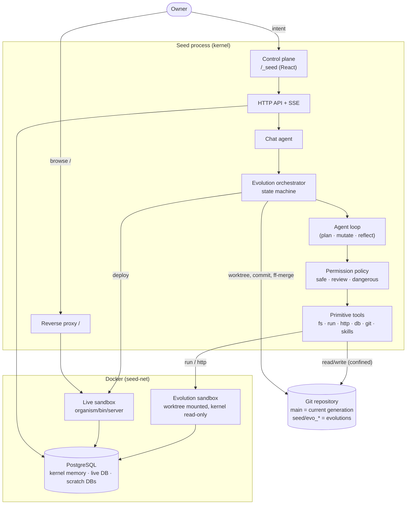

# Architecture

A Seed is one git repository and one process tree, and it presents one identity:

```
SEED
├── Kernel         kernel/ cmd/ control/ seed.yaml Dockerfile Makefile   (protected)
├── Control Plane  /_seed: served by the kernel, renders the Seed's current identity
└── Organism       organism/: everything the Seed grows; served at /
    + Knowledge    knowledge/: self model, narrative, decisions, logo
    + Skills       skills/: learned know-how
```



## Kernel (`kernel/`)

| package | responsibility |
|---|---|
| `agent` | The agent harness: a model in a loop with tools, context compaction, prompts (`prompts/*.md`) |
| `models` | Provider-neutral `Model` interface. OpenRouter is offered to owners, while Anthropic and OpenAI-compatible are implemented. A `Switchable` model changes live when the owner picks another model. There is a scripted fake for tests. Retries with backoff. |
| `tools` | Primitive tools and the `Registry`, which classifies every call and enforces permissions |
| `permissions` | Risk levels, policy, approvals, kernel-path protection |
| `sandbox` | `Driver`/`Sandbox` interfaces. The Docker driver gives isolation; the local driver is for tests. |
| `evolution` | The orchestrator: state machine, workspaces, verification, reflection, commit, apply, rollback, recovery |
| `memory` | Operational memory in PostgreSQL: conversations, evolutions, events, generations, approvals |
| `knowledge` / `skills` | Read the Seed's self model, narrative and skills from the repository |
| `git` | Git CLI wrapper (worktrees, commits, trailers, fast-forward) |
| `migrate` | Ordered, checksummed SQL migrations (used for kernel memory and the organism) |
| `infra` | PostgreSQL container, Docker network, sandbox image |
| `runtime` | Boot, the live organism supervisor and proxy, the HTTP API, SSE, chat |
| `template` | `seed new`: plants a pristine Seed and commits generation 1 |

`seed run` compiles the Seed's **own** `cmd/seed` from its own source and runs it. When an
(approved) evolution changes the kernel, the kernel exits with code 75, and `seed run` rebuilds it and
restarts into it.

## Control plane (`control/web`)

React + TypeScript + Vite, built to `control/web/dist`, which is committed and embedded in the
kernel binary. It is a client of the [API](api.md) and the SSE event stream. It shows the Seed's
current identity (name, tagline, accent and logo from `knowledge/`), so after the Seed becomes "Tasks",
the control plane is Tasks' control plane.

**The control plane is the Seed's admin panel, and it grows.** The kernel provides chat,
evolutions, generations, skills, knowledge, logs and settings. Everything specific to what the
Seed has become, such as stats, data management or signups, the Seed adds itself as **admin screens**.
It declares them in `organism/control/extensions.json` (`[{id, title, path}]`) and serves them as
ordinary organism pages. The control plane lists them under "Admin" and shows them inside its own
layout, refreshing the list on every new generation. The `control-plane-screens` skill teaches the
procedure. Asking *"I want somewhere here to see task stats"* produces a screen there, versioned and
rolled back like any other part of the organism.

**Identity.** Once the Seed takes a name, it *is* that name everywhere: the control plane, its
voice in chat and in its prompts (`agent.PromptFor`), the author of its git commits, `seed status`,
logs, and the fallback page. "Seed" remains only the name of the technology and of the `seed` CLI.

## Organism (`organism/`)

Ordinary software with one contract (`seed.yaml` → `organism`):

- `make -C organism build` produces `organism/bin/server` and `organism/web/dist`.
- `make -C organism test` runs tests. `go test -v` and vitest output are parsed for counts.
- `organism/bin/server` listens on `$PORT`, uses `$DATABASE_URL`, and answers `GET /healthz`.
- `organism/migrations/NNNN_*.sql` are applied by the kernel.

The initial organism is an empty shell: a Go server with `/healthz`, an SPA fallback, and a React
page that says *I don't have a purpose yet*.

## Data

One PostgreSQL server (`seed-postgres`) holds, per Seed:

| database | owner | contents |
|---|---|---|
| `<name>_seed` | kernel | operational memory |
| `<name>_app` | `<name>_organism` role | the live organism's data |
| `<name>_evo_<id>` | `<name>_evolver` role | scratch database per evolution, dropped afterwards |

Names also carry the Seed's instance id (a short hash of its root commit), so Seeds that share a
name never share memory. Neither role is a superuser, neither can reach kernel memory, and the
evolution role cannot connect to the live database.

## Observation

The Seed perceives what it creates through compiler output, test output, process status, logs,
HTTP responses, database schema, git diff, and health checks. All are exposed as tools during
evolution and are re-checked independently by the kernel. `tools.HTTP` and `Sandbox.Logs` are the
observation seams; browser-level observation (screenshots, DOM checks) can be added as another
tool that runs a headless browser inside the sandbox, without changing the orchestrator.
