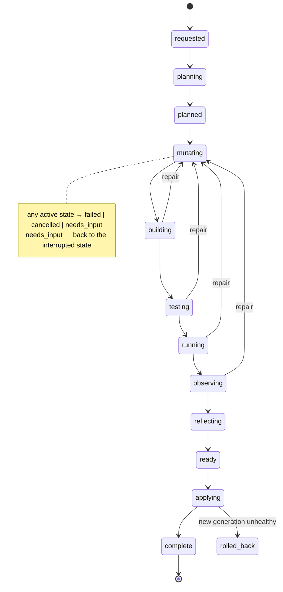

# Evolution lifecycle

An **evolution** turns an intent into a new **generation**. It is a first-class record
(`evolutions` table) with its intent, plan, base generation, status, checks, reflection, commit,
new generation, token usage, and a full event log (`evolution_events`) of phases, tool calls,
checks and notes.



## Phases

1. **Intent.** The owner says something in chat. The chat agent decides whether it is a question
   (answered from knowledge) or an intent, and calls `start_evolution` with a self-contained statement.
   Evolutions are queued and run one at a time.
2. **Planning** (read-only tools). The agent reads its knowledge, skills, generation history, live
   schema and code, then submits a structured plan: title, scope, summary, steps, capabilities,
   risks. It includes an *identity* step when the Seed takes on a new purpose. Optional owner
   approval (`require_plan_approval`).
3. **Workspace.** A git worktree on branch `seed/evo_<id>` from the current generation, a scratch
   database `<name>_evo_<id>`, and a Docker sandbox with the worktree mounted at `/workspace`
   (kernel paths read-only).
4. **Mutating.** The builder agent edits files, runs builds and tests, applies migrations, starts
   the organism and makes HTTP requests, all inside the sandbox. It ends by calling `finish` with a
   summary and the HTTP checks that prove the change works.
5. **Verification by the kernel** (not the agent's word):
   - **building**: `make -C organism build`
   - **testing**: a fresh scratch database, all migrations applied, then `make -C organism test`
   - **running**: another fresh database, migrations, start the server, wait for `/healthz`
   - **observing**: `GET /healthz`, `GET /`, and every check the builder declared

   Any failure returns the output to the builder for **repair**, up to `max_repair_attempts`.
6. **Reflecting.** The agent can now write only `knowledge/` and `skills/`. It updates the self model,
   product and architecture docs, adds decision records, and creates or improves skills. It then
   submits a structured reflection. `self.yaml` and skills are validated.
7. **Commit.** The kernel checks that no protected path changed without owner approval, then commits:

   ```
   evolve(tasks): add task priorities

   Tasks should have priorities: low, medium and high…

   Added a priority column, API filter and UI selector…

   Evolution: evo_01J…
   Generation: 2 -> 3
   ```
8. **Applying.** Refused if the live tree is dirty or main moved. Otherwise main is
   **fast-forwarded** to the commit, and the live organism is rebuilt, the live database migrated,
   the server restarted and health-checked. If the new generation is unhealthy, main is reset to the
   previous generation, which is redeployed, and the evolution ends `rolled_back`.
9. **Complete.** A generation record is created, `seed/gen-N` is tagged, and the Seed posts *"I am now
   generation N"*. The control plane shows the new identity.

## Generations and rollback

A generation is a commit on main with `Generation:` and `Evolution:` trailers. Git is the source
of truth: if kernel memory is lost, generations are rebuilt from history at boot.

Rollback (`seed rollback 2`, or the Generations page) is itself an evolution of kind `rollback`.
It creates a **new** generation whose tree equals the target's, so history is never rewritten.
Code and knowledge roll back. **Database migrations do not**, which is why the
`postgres-migration` skill requires additive, backwards-compatible migrations.

## Failure, interruption and recovery

- A failed evolution leaves the live Seed untouched. Its worktree is kept under
  `.seed/worktrees/<id>` for inspection, and the reason is posted in chat.
- Cancelling (API/UI) stops the agent between steps. Once applying has begun, it finishes.
- At boot, the kernel reconciles interrupted evolutions. One that was `applying` and whose commit
  is already main's HEAD is completed. Anything else in progress is marked `failed` ("interrupted by
  a kernel restart while testing"), its scratch database and sandbox are cleaned up, and the Seed
  tells the owner. Pending approvals are expired, and queued evolutions run normally.
